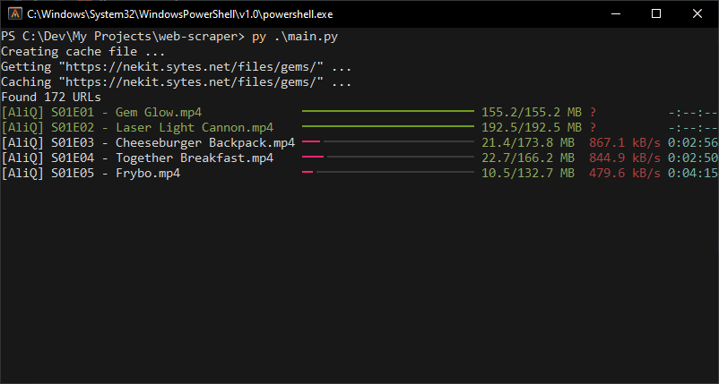

## Requirements
```
pip install beautifulsoup4 rich requests
```

## Usage
Modify the script if needed.

Default options:
```py
BASE_URL = "https://nekit.sytes.net/files/gems/"

OUTPUT_FOLDER = "output"
CACHE_FILE = "html-cache.json"
WORKERS = 3
```
